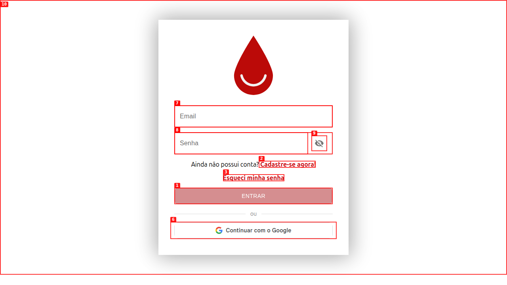
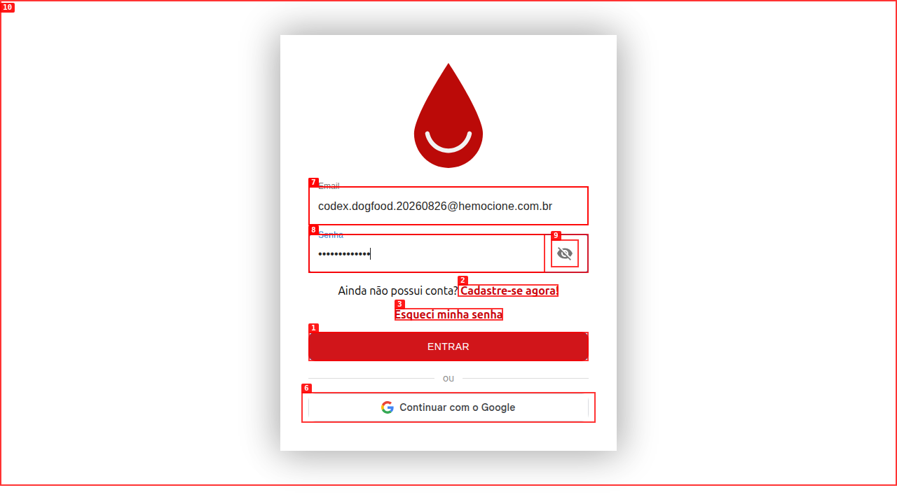
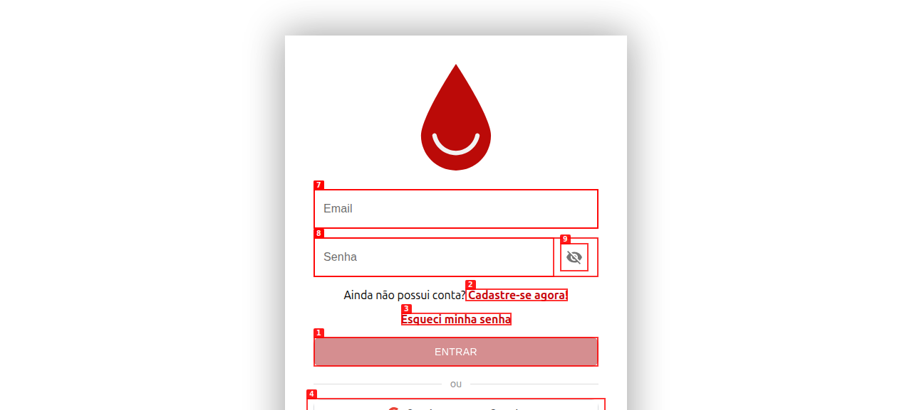
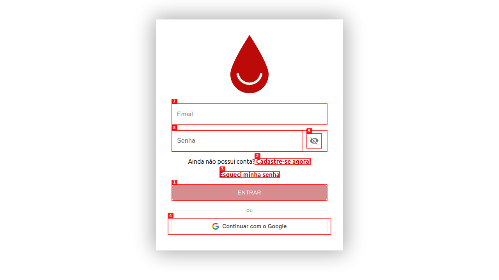
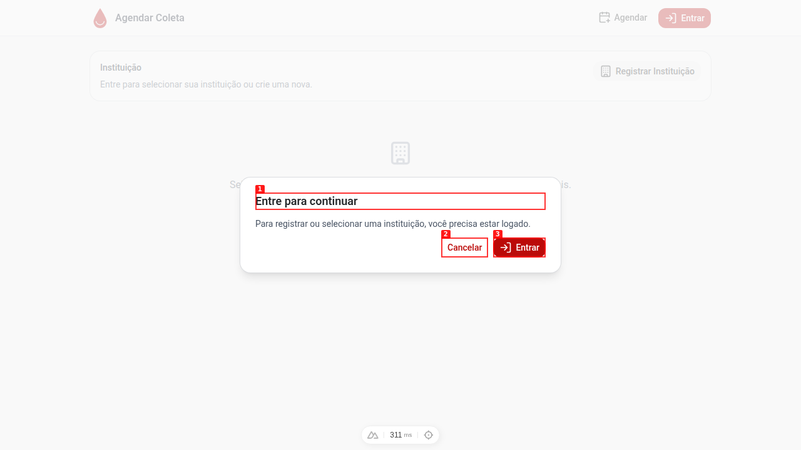
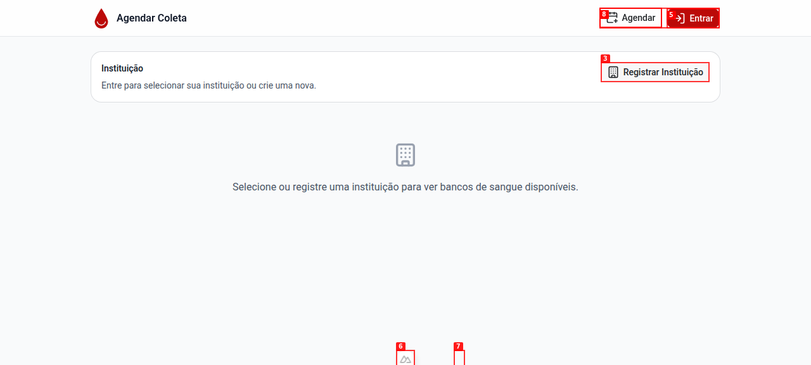

# Dogfood Report: Hemocione Coleta

| Field | Value |
|-------|-------|
| **Date** | 2026-08-27 |
| **App URL** | http://127.0.0.1:3001 |
| **Session** | coleta-develop-dev |
| **Scope** | Autenticação, cadastro, área pública, termos, responsividade e boot do servidor |

## Summary

| Severity | Count |
|----------|-------|
| Critical | 1 |
| High | 3 |
| Medium | 2 |
| Low | 1 |
| **Total** | **7** |

Os totais incluem achados encontrados e corrigidos nesta sessão.

## Issues

<!-- Copy this block for each issue found. Interactive issues need video + step-by-step screenshots. Static issues (typos, visual glitches) only need a single screenshot -- set Repro Video to N/A. -->

### ISSUE-001: Login entra em loop no portal de identidade

| Field | Value |
|-------|-------|
| **Severity** | critical |
| **Category** | functional |
| **URL** | http://localhost:3001/ |
| **Repro Video** | videos/issue-001-repro.webm |

**Status:** fixed.

**Description**

Após um login válido no Hemocione ID, o portal retorna ao Coleta com `?token`. O Coleta redireciona para o portal novamente. O usuário nunca alcança uma rota autenticada.

Esperado: o retorno do Hemocione ID valida o token e abre a aplicação.

Resultado: o navegador termina no formulário de login do Hemocione ID. O ciclo impede todos os fluxos autenticados.

**Repro Steps**

<!-- Each step has a screenshot. A reader should be able to follow along visually. -->

1. Navegue para `http://localhost:3001/`.
   

2. Informe um usuário dev válido no formulário do Hemocione ID.
   

3. Clique em `ENTRAR`.
   

4. **Observe:** o navegador termina novamente no formulário do Hemocione ID. A rota observada no portal é `/`, sem uma sessão funcional no Coleta.
   

---

### ISSUE-002: Modal de autenticação não tem nome acessível

| Field | Value |
|-------|-------|
| **Severity** | medium |
| **Category** | accessibility |
| **URL** | http://localhost:3001/agendar |
| **Repro Video** | videos/issue-002-repro.webm |

**Description**

Ao clicar em `Registrar Instituição` sem autenticação, o modal mostra `Entre para continuar`. O elemento `role="dialog"` referencia um `aria-labelledby` inexistente. O audit axe-core classifica `aria-dialog-name` como violação séria.

Esperado: o modal expõe um nome válido para leitores de tela.

Resultado antes da correção: o leitor de tela não recebe o nome do diálogo.

**Status:** fixed. A nova execução encontrou 0 violações no modal. Veja `screenshots/final-login-modal.png`.

**Repro Steps**

1. Navegue para `http://localhost:3001/agendar`.
   

2. Clique em `Registrar Instituição`.
   

3. **Observe:** execute `agent-browser a11y --json`. O resultado não contém violações no modal.

---

### ISSUE-003: Documento HTML não define idioma nem título nível 1

| Field | Value |
|-------|-------|
| **Severity** | medium |
| **Category** | accessibility |
| **URL** | http://localhost:3001/agendar |
| **Repro Video** | N/A |

**Description**

O audit axe-core encontrou `html-has-lang` e `page-has-heading-one` na página pública. O elemento `<html>` não define `lang`, e a página não tem um título nível 1.

Esperado: a página define `lang="pt-BR"` e fornece um título nível 1.

Resultado antes da correção: leitores de tela perdiam o idioma e a hierarquia principal da página.

**Status:** fixed. A nova execução encontrou 0 violações do aplicativo. O único resultado restante pertence ao Nuxt DevTools.

**Repro Steps**

1. Navegue para `http://localhost:3001/agendar`.
   

2. Execute `agent-browser a11y --json`.

3. **Observe:** o resultado não contém `html-has-lang` nem `page-has-heading-one`.

---

### ISSUE-004: Sessão desaparece após recarregar a página

| Field | Value |
|-------|-------|
| **Severity** | high |
| **Category** | functional |
| **URL** | http://localhost:3001/agendar |
| **Repro Video** | videos/issue-001-repro.webm |

**Description**

Antes da correção, o login funcionava até o primeiro recarregamento. O estado ficava somente no Pinia, e o cookie do Hemocione ID não era válido para `localhost`.

Esperado: o usuário permanece autenticado após recarregar a página.

Resultado antes da correção: `/agendar` mostrava novamente o convite de login após o recarregamento.

**Status:** fixed. O middleware grava o token no cookie local. O logout limpa usuário, token e cookie.

**Evidence:** `session-reload-before-fix.txt`, `authenticated-flow.txt`, `tests/unit/middleware/auth.global.test.ts` e `tests/unit/stores/user.test.ts`.

---

### ISSUE-005: Termo público exige autenticação

| Field | Value |
|-------|-------|
| **Severity** | high |
| **Category** | functional |
| **URL** | http://localhost:3001/termo/invalido |
| **Repro Video** | N/A |

**Description**

Antes da correção, o middleware global enviava visitantes da rota `/termo/:token` ao Hemocione ID. A página usa APIs públicas.

Esperado: um termo acessível por link abre sem sessão e mostra seu estado.

Resultado antes da correção: o visitante não alcançava a página do termo.

**Status:** fixed. `/termo/invalido` abre sem sessão e mostra `Termo de compromisso não encontrado.` Veja `screenshots/final-invalid-term.png`.

---

### ISSUE-006: Token inválido era enviado no callback externo

| Field | Value |
|-------|-------|
| **Severity** | high |
| **Category** | security |
| **URL** | http://localhost:3001/?token=invalid |
| **Repro Video** | videos/issue-001-repro.webm |

**Description**

Antes da correção, o callback para o Hemocione ID preservava o parâmetro `token` da URL. Esse valor não precisava voltar ao provedor de identidade.

Esperado: o callback preserva caminho e outros parâmetros, mas remove `token`.

Resultado antes da correção: o callback incluía `token`.

**Status:** fixed. O teste de regressão confirma a remoção somente de `token`. Em produção, o callback mantém `siteUrl`; no desenvolvimento local, usa a origem atual.

---

### ISSUE-007: Boot registra índice Mongoose duplicado

| Field | Value |
|-------|-------|
| **Severity** | low |
| **Category** | console |
| **URL** | http://localhost:3001/ |
| **Repro Video** | N/A |

**Description**

O boot do servidor registrava o aviso `Duplicate schema index on {"accessToken":1}`. O campo já declara o índice único, e o schema também o declarava.

Esperado: o boot não registra o aviso de índice duplicado.

Resultado antes da correção: o aviso aparecia durante a conexão com MongoDB.

**Status:** fixed. O boot atual conecta ao MongoDB sem o aviso. O log atual confirma os índices únicos sem a mensagem de duplicidade.

---

## Cobertura final

- Página pública `/agendar` em desktop e viewport de 390 × 844.
- Menu móvel, modal de login e estados sem instituição.
- `/termo/invalido`, `/agendar/acompanhar/invalido` e `/agendar/nao-existe`.
- Auditoria axe-core no documento público e no modal.
- Console do navegador e erros de carregamento nas rotas públicas.
- Login, recarregamento, logout confirmado e cadastro sintético de instituição em dev.
- Validação de CNPJ inválido com bloqueio do botão `Salvar`.
- Suíte unitária completa e build Nuxt.
- Boot do servidor com MongoDB local.
